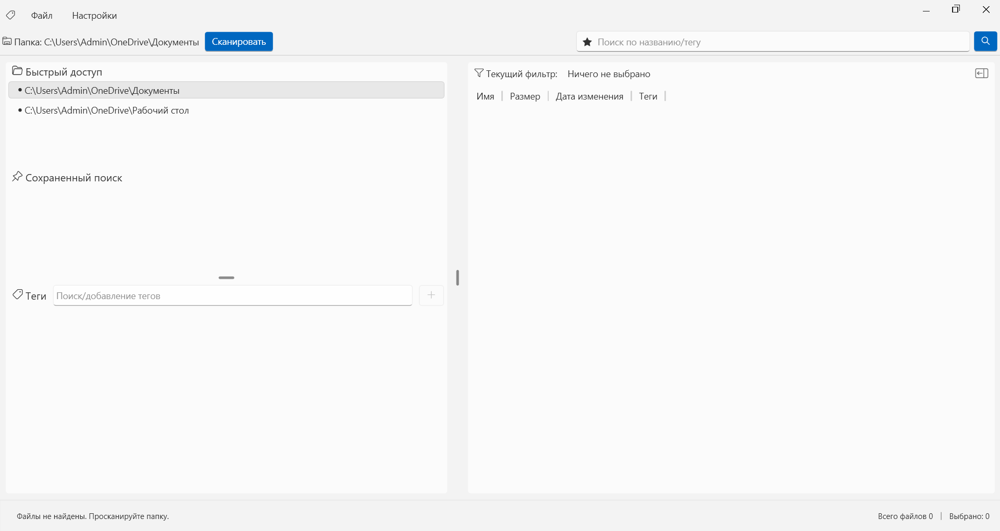
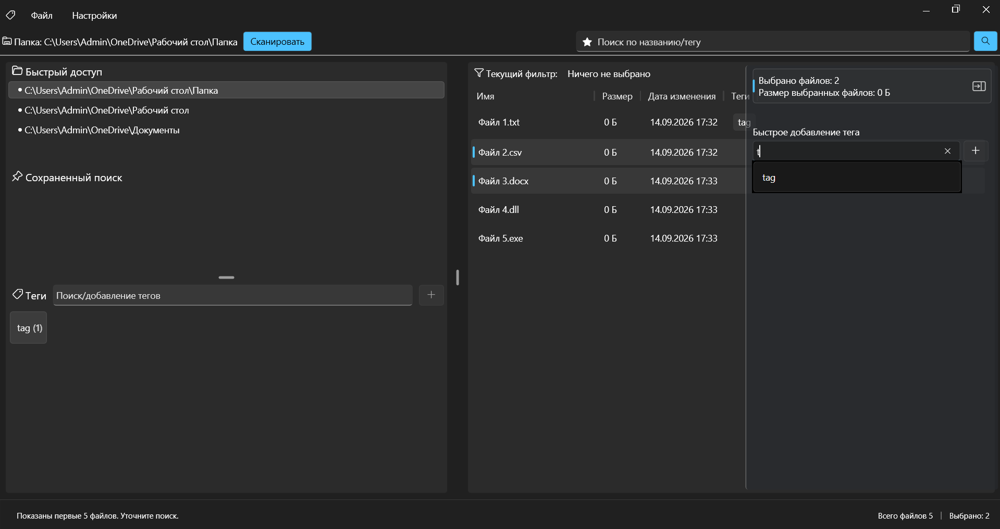
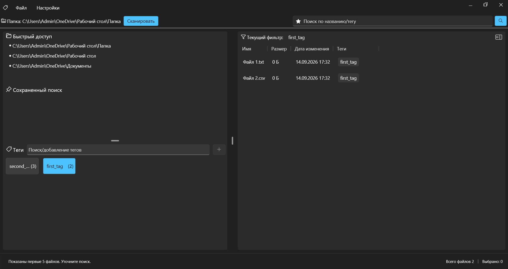

**Tagger** — простое WPF приложение для быстрой фильтрации, поиска файлов и управления тегами

## Скриншоты

| Главное окно | Управление тегами | Поиск и фильтрация |
| :---: | :---: | :---: |
|  |  |  |

## Кратко
- Десктопное WPF-приложение (MVVM, CommunityToolkit.Mvvm) на .NET 10.
- Индексирует файлы в папках, позволяет создавать теги и привязывать их к файлам.
- Хранит данные в SQLite (EF Core).

## Ключевые фичи
* **Сканирование папки:** Рекурсивное сканирование папок с пакетной вставкой в БД.
* **Управление тегами:** Создание/удаление тегов, привязка тегов к множественным файлам.
* **Смена темы:** Light / Dark / System тема с сохранением выбора.
* **Быстрый поиск:** Мгновенная фильтрация тегов по мере ввода (с защитой от задержек и состояний гонки).
* **Локальное хранение:** Все данные сохраняются в локальную базу данных SQLite.
* **Портативность:** Настройки и база данных изолированы в системной папке, что гарантирует безопасность при обновлениях.
* **Современный UI:** Поддержка плавной анимации, drag-and-drop элементов и адаптивного списка тегов.

## Скачать и запустить (для пользователей)
1. Перейдите в раздел [Releases](../../releases/latest).
2. Скачайте актуальную версию **`Tagger.exe`**.
3. Запустите файл (установка и предварительная настройка .NET не требуются).

---

## Сборка из исходников (для разработчиков)
### Требования
* Установленный [.NET 10.0 SDK](https://microsoft.com)
* Visual Studio (или VS Code)

### Шаги для запуска
1. Клонируйте репозиторий:
   ```bash
   git clone https://github.com/Sergey-sk/Tagger
   ```
2. Откройте проект в Visual Studio.
3. Запустите сборку и отладку (F5).

---

## Архитектура и стек
* **UI Framework:** WPF (.NET 10)
* **MVVM Library:** [CommunityToolkit.Mvvm](https://microsoft.com)
* **Database:** Entity Framework Core + SQLite

